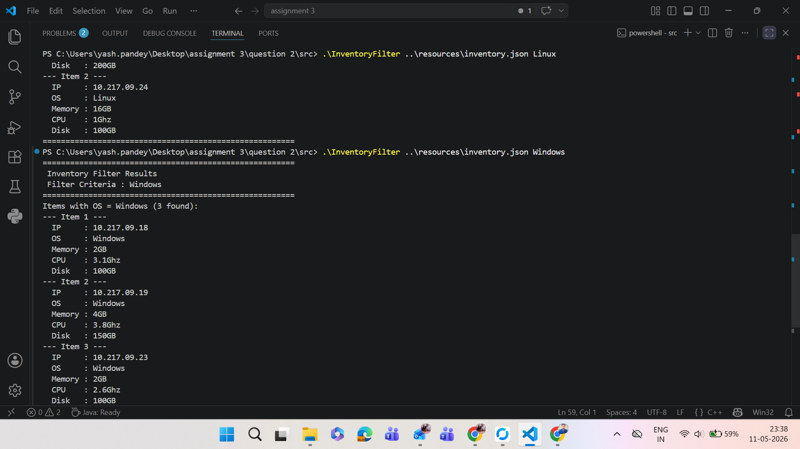

# Q1 - Log File Parser

## What does it do?

Reads a `.log` file, filters log entries by type (error, info, warning, debug),
and displays the most recent N lines in reverse order (latest first).

---

## Tech Stack

| Layer | Technology |
| --- | --- |
| Language | Java 11 |
| Build Tool | Maven |
| Testing | JUnit 4 |
| Design | OOP + Custom Exceptions |

---

## Folder Structure

```
question 1/
├── src/
│   ├── main/java/
│   │   ├── Main.java                    ← Entry point
│   │   ├── LogEntry.java                ← POJO: logType, message, lineNumber
│   │   ├── LogFileParser.java           ← Core logic: read, filter, reverse
│   │   ├── InputValidator.java          ← Validates filePath and logType
│   │   ├── InvalidFileException.java    ← Custom exception: invalid file
│   │   └── InvalidLogTypeException.java ← Custom exception: invalid log type
│   └── test/java/
│       └── LogFileParserTest.java       ← JUnit test cases
├── resources/
│   └── Log_19_10_17_11_42_01.log        ← Sample log file
└── pom.xml                              ← Maven config
```

---

## Solution Explained

- Takes 3 input parameters: `filePath`, `numberOfLines` (default 10), `logTypes` (default error)
- Validates file path exists and log type is valid
- Reads the log file and filters entries by log type
- Returns the most recent N matching lines from end of file
- Throws `InvalidFileException` if file not found
- Throws `InvalidLogTypeException` if log type is not error/warning/info/debug

---

## How to Run

### Step 1: Go to question 1 folder

```
cd "question 1"
```

### Step 2: Compile

```
mvn compile
```

### Step 3: Run

```
mvn exec:java "-Dexec.mainClass=Main" "-Dexec.args=resources\Log_19_10_17_11_42_01.log 5 error,info"
```

---

## Output Screenshots


---

# Q2 - Inventory Filter

## What does it do?

Reads an inventory JSON file and filters items based on given criteria —
finds item with MAX Memory/CPU, or filters all items by OS type (Linux/Windows).

---

## Tech Stack

| Layer | Technology |
| --- | --- |
| Language | C++ |
| Compiler | g++ |
| Input | JSON file |
| Design | OOP with header files |

---

## Folder Structure

```
question 2/
├── src/
│   ├── Main.cpp               ← Entry point
│   ├── InventoryFilter.cpp    ← Filter logic: MAX memory/CPU, OS filter
│   ├── InventoryFilter.h
│   ├── InventoryItem.cpp      ← InventoryItem model class
│   ├── InventoryItem.h
│   ├── JsonParser.cpp         ← JSON file parser
│   └── JsonParser.h
└── resources/
    └── inventory.json         ← Sample inventory data
```

---

## Solution Explained

- Parses inventory JSON file using custom JsonParser class
- Supports 4 filter criteria: `Memory`, `CPU`, `Linux`, `Windows`
- For `Memory` / `CPU` → finds and displays item with maximum value
- For `Linux` / `Windows` → displays all items matching that OS type
- Raises exception if filter criteria is missing or invalid

---

## How to Run

### Step 1: Go to src folder

```
cd "question 2\src"
```

### Step 2: Compile

```
g++ -o InventoryFilter Main.cpp InventoryFilter.cpp InventoryItem.cpp JsonParser.cpp
```

### Step 3: Run

```
.\InventoryFilter ..\resources\inventory.json Memory
.\InventoryFilter ..\resources\inventory.json CPU
.\InventoryFilter ..\resources\inventory.json Linux
.\InventoryFilter ..\resources\inventory.json Windows
```

---

## Output Screenshots




---

# Q3 - Hardware Info Fetcher

## What does it do?

Detects the current OS (Windows/Linux) and fetches real-time hardware information —
hostname, memory, CPU, IP address, and disk size — displayed in JSON format.

---

## Tech Stack

| Layer | Technology |
| --- | --- |
| Language | Python 3.x |
| Design | OOP - Abstract Base Class |
| OS Commands (Windows) | PowerShell Get-CimInstance |
| OS Commands (Linux) | lscpu, free -h, df -h, hostname -I |
| Output | JSON format |

---

## Folder Structure

```
question 3/
├── main.py           ← Entry point: detects OS, instantiates correct class
├── host_info.py      ← Abstract base class HostInfo (ABC)
├── windows_host.py   ← WindowsHost class (inherits HostInfo)
└── linux_host.py     ← LinuxHost class (inherits HostInfo)
```

---

## Solution Explained

- `HostInfo` is abstract base class with attributes: `hostname`, `memory`, `cpu`, `ip`, `disk_size`
- `get_hardware_info()` is abstract method — must be implemented by subclasses
- `WindowsHost` uses PowerShell `Get-CimInstance` commands (works on Windows 10/11)
- `LinuxHost` uses shell commands: `free -h`, `lscpu`, `df -h`, `hostname -I`
- `display_hardware_info()` prints all info in JSON format
- `main.py` auto-detects OS using `platform.system()` and creates correct object

---

## How to Run

### Step 1: Go to question 3 folder

```
cd "question 3"
```

### Step 2: Run

```
python main.py
```

---

## Output Screenshots


